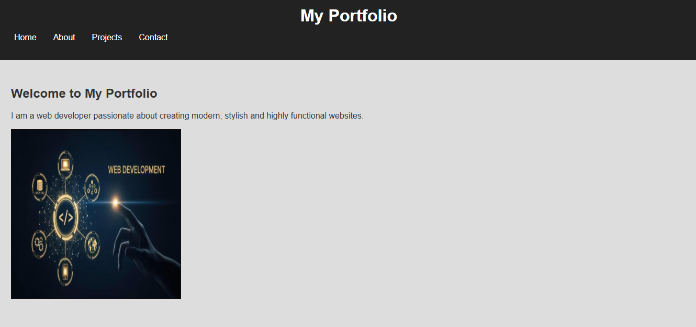
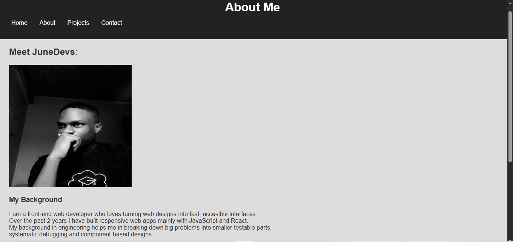
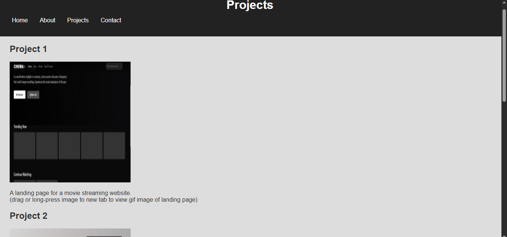
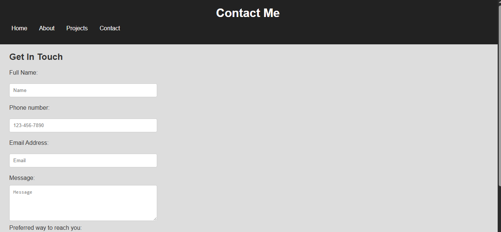
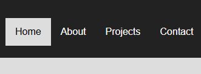
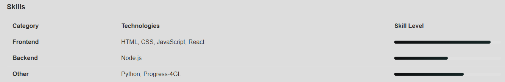

# Portfolio Website

## Overview:

This is a portfolio website for a developer or a small agency that builds websites. It is a multi-page website consisting of the home, about, projects, and contact pages. In this website you are able to view the developer's background information, skill levels, and past completed projects. On the contact page, you are able to leave your contact information and message to the agency or developer so that you are contacted at a later stage.

## Issues found in the starter code and fixes implemented:

### Home page:

1. Regularly fixed indentation by using ctrl + alt + F.
2. Added a meta tag, so that the website displays characters correctly.
3. Added “./” to the pathway of the href attribute to correctly reference the stylesheet.
4. Added lang = “en” on the html opening tag so that the website reads in English.
5. Added a navigation bar on the header. The navigation bar was missing completely.
6. Properly aligned the title to center. Alignment was missing.
7. Added images folder to directory.
8. Renamed the welcome/profile photo to welcome.png. 
9. Added the alternate attribute to the img tag. This was missing completely, and it posed an accessibility issue.
10. Added an email link to the footer. It was just plain unclickable text at first.
11. Changed the welcoming text on the hero section.
12. Changed the text on the about me section, it was lorem ipsum at first. Then added links to the contact and projects page.
13. Changed generic 
 tags with semantic HTML5 elements across the html pages to header, main, section, article and footer tags

### About page:

1. Regularly fixed indentation by using ctrl + alt + F.
2. Similarly added a meta tag.
3. Similarly added “./” to the href attribute. It was missing.
4. Similarly added lang = “en”. It was missing.
5. Similarly added a navigation bar. It was completely missing.
6. Edited the paragraph on developer background section to be more informative.
7. Used h2 heading for the photo section and h3 for background and skills for better visual appearance.
8. Added a table to list developer skills. It was completely missing.
9. Removed my photo section to be right below the header for better flow/hierarchy. And I renamed the section to “Meet JuneDevs”.
10. Fixed footer to resemble the one in the home page

### Projects page:

1. Similarly fixed indentation, added a meta tag, added “./” to the href attribute, and added a navigation bar.
2. Added a main tag to add a list of projects.
3. Added images for projects 1 and 2, and added their respective alternate attributes. Sections for the images were present but the photos and the alt text were missing.
4. Added project 3. It was not there completely. I added the title, photo and alt text.
5. Fixed footer to resemble the one in the home page.

### Contact page:

1. Similarly fixed indentation, added a meta tag, added “./” to the href attribute, and added a navigation bar.
2. Added more input types to the form. I added the tel input type for the user’s phone number and a dropdown list for the user’s contact preference.
3. Added corresponding labels to the input types. Labels were completely missing.
4. Added validation to the inputs.
5. Added form ID, action and method attributes. These were completely missing.
6. Fixed footer to resemble the one on the home page.

### Style sheet:

1. Added navigation styling. It was completely missing.
2. Managed to use hover and focus pseudo-classes in the navigation bar.
3. Used selector combinations in the navigation bar..
4. Removed 36px font size for h2 heading, as it made the h2 heading appear like an h1 heading.
5. Changed the background color of the body tag to #ddd. This was just my style choice.
6. Changed the background color of the hero section to match the body, to fix the poor color contrast that initially existed.
7. Changed the hero and footer padding to 30px, to left-align the main content of the home page.
8. Fixed the width and height of the img tags to 325px respectively. I used the element tag so that any image added would have the same dimensions. This improves uniformity and visual appearance. 
9. Combined selectors to left-align the rest of the html pages’content.
10. Added styling for the table on the about me page. It was completely missing.
11. Added styling for the forms. It was completely missing.
12. Added styling for the submission button. Styling was completely missing.
13. Added basic CSS animation for the footers on all of the website’s pages. (for bonus appeal)
14. Added comments for better readability.
15. Fixed indentation by using ctrl + alt + F.

## Description of final HTML structure:

All four pages of the website are constructed following the HTML boilerplate and layout.
The website is built with the consideration of the Document Object Model.
This is so that the structure can be modified and styled by programs or technologies such as JavaScript.
HTML5 semantics are used for better code readability and search engine optimization.

## CSS approach and selectors used:

The styling approach was to improve overall appearance of the website. This included fixing bad color contrasts, enhancing text styling with appropriate fonts, sizes and hierarchy. Then to provide styling were styling was missing in the starter code. Selectors used include: element, class, id, attribute and pseudo-selectors. Selector combination was also used to improve code quality.

## Main accessibility improvements:

1. Used alternate attributes to describe images.
2. Wrote CSS that makes website responsive for different devices.
3. Included a meta tag in the html so that browser reads characters correctly.

## Instructions on how to view website locally:

1. You can download the portfolio-website folder from github onto your local device.
2. Open the folder with a code editor like Visual Studio Code.
3. Open preview of the index html file.
4. Copy the url on the preview browser.
5. Paste url on your device's browser. You will reach the home page of the website.

## Screenshots:

### Home page

### About page

### Projects page

### Contact page

### Navigation menu

### Styled table

### Projects before styling
.png)

### Projects after styling
.png)

### Form before modification and styling
.png)

### Form after modification and styling
.png)

## Reflection:

1. I did not know where to start with the debugging task. I was not organized.
2. There were many things to fix at different places. I had to do my own checklist and to solve the problem bit by bit.
3. I had to make a wireframe of how I want the site to look.
4. I then started with the home page. Found the errors, fixed them and styled. I continued with that procedure until I got to the contact page.
